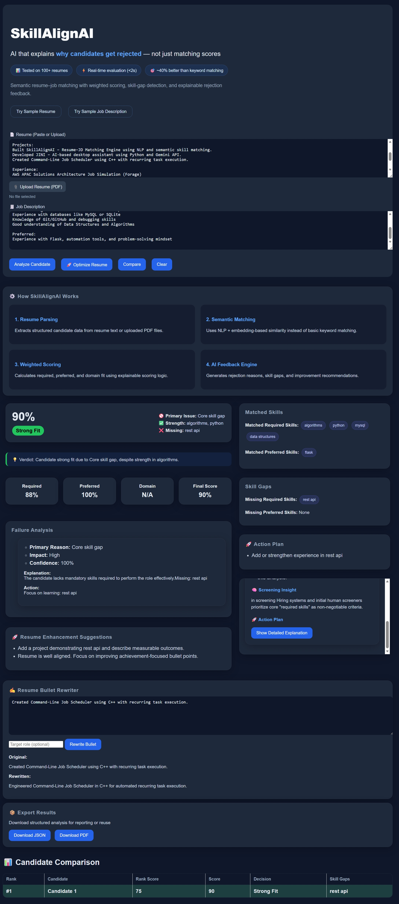
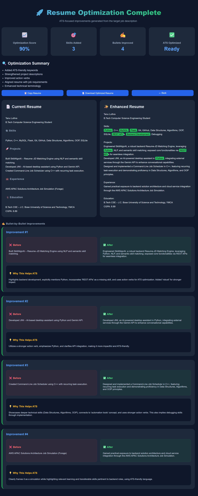
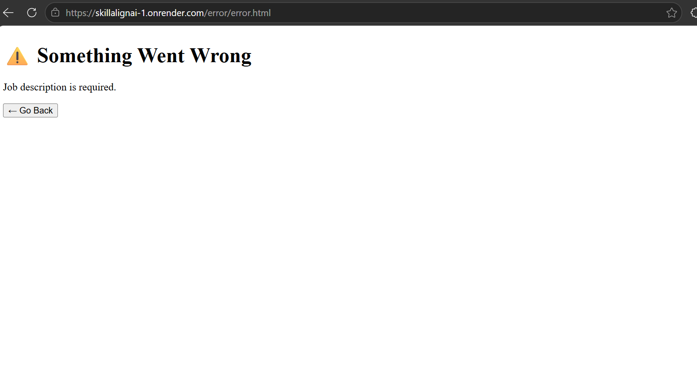

# SkillAlignAI 🚀  

> AI-Powered Resume & Job Description Alignment Engine   

SkillAlignAI is an intelligent ATS-style evaluation platform that analyzes resumes against job descriptions using semantic skill matching, weighted scoring, domain awareness, and explainable AI feedback.

It helps recruiters evaluate candidates more transparently and helps job seekers understand exactly why they may or may not be a strong fit for a role.

---

## 🌐 Live Demo

Frontend: https://skillalignai-1.onrender.com  
Backend API: https://skillalignai.onrender.com/analyze

---

## ✨ Feature Highlights

### Resume Analysis

- Resume vs Job Description matching
- PDF and text resume support
- Semantic skill matching
- Domain-aware evaluation
- ATS-style weighted scoring

### Explainable AI

- Detailed rejection analysis
- Primary rejection reasons
- Improvement suggestions
- Confidence-based evaluation

### Resume Optimization

- ATS keyword enhancement
- Resume rewriting assistance
- Bullet-by-bullet improvements
- Resume enhancement dashboard

### Candidate Comparison
- Multi-candidate ranking
- Risk-aware comparison
- Missing-skill analysis
- Recruiter-friendly decision support

### Export & Reporting
- PDF report export
- JSON report export
- Audit trail generation
- Explainable scoring breakdown

### User Experience

- Interactive dashboard
- Error handling page
- Modern dark UI
- Responsive design

---

## 🎯 Problem

Most ATS systems suffer from several limitations:
- No meaningful rejection feedback
- Heavy reliance on keyword matching
- Poor understanding of related skills
- Lack of transparency in scoring decisions

As a result, candidates are often rejected without understanding why, making improvement difficult.

---

## 💡 Solution

SkillAlignAI introduces a transparent ATS-style evaluation workflow that:

- Separates skill matching from domain matching
- Uses semantic relationships between technologies
- Applies weighted scoring logic
- Generates explainable rejection insights
- Provides resume improvement recommendations

---

## 🧠 What Makes It Different

Unlike traditional ATS clones, SkillAlignAI supports:

### Semantic Skill Matching

Examples:

```text
React → JavaScript
Flask → Python
TensorFlow ↔ PyTorch
```

The system understands relationships instead of relying solely on exact keyword matches.

### Confidence-Based Scoring

Each match receives a confidence level:

```text
Direct Match      = 1.0
Inferred Match    = 0.5
Fuzzy Match       = 0.3
```

### False Positive Prevention

The engine avoids incorrect matches such as:

```text
Java ≠ JavaScript
C ≠ C++
SQL ≠ NoSQL
```

### Domain Awareness

Example:

```text
Resume: HTML, CSS, ML
JD: Machine Learning Engineer
```

The candidate may show domain interest but still lack required technical skills.

---

## ⚙️ Core Capabilities

- Resume Upload (PDF/Text)
- Resume Parsing
- Job Description Analysis
- Semantic Skill Matching
- Domain Detection
- Explainable ATS Scoring
- Resume Optimization
- Candidate Comparison
- Export Reports

---

## 🧮 Scoring Logic
```text
Base Score = 0.8 × Required Match + 0.2 × Preferred Match
Final Score = Base × (0.7 + 0.3 × Domain Match)
```

### Score Components
|**Components**|**Purpose**|
|---|---|
|Required Match|Core competency measurement|
|Preferred Match|Competitive Advantage|
|Domain Match|Contextual alignment|
|Final Score|Overall candidate fit| 

---

## 🚧 Engineering Challenges Solved

### Skill Hierarchy Matching
```text
React → JavaScript
Node.js → JavaScript
```

### Sibling Skill Detection
```text
TensorFlow ↔ PyTorch
MongoDB ↔ PostgreSQL
```

### Fuzzy Matching
```text
Pyhton → Python
Javascrpt → JavaScript
```

### False Positive Prevention
```text
Java ≠ JavaScript
C ≠ C++
```

---

## ⚡ Example Evaluation

**Input:**
``` text 
Resume: html, css, ml
JD: machine learning 
```

**Output:**
- Required Match: 0%  
- Domain Match: 100%  
- Final Score: 0%  

**Interpretation:**  
Candidate shows interest in ML domain but lacks required technical skills.

---

## 🏗️ System Architecture

### High-Level Workflow
```text
Frontend → Resume Parser → JD Analyzer → Normalization → Semantic Matching Engine → Scoring Engine → Explanation Generator → Interactive Dashboard
```

### Core Modules

#### Resume Parser

Extracts:

- Skills
- Projects
- Experience
- Education

#### JD Analyzer

Identifies:

- Required Skills
- Preferred Skills
- Role Context

#### Semantic Matching Engine

Handles:

- Direct matches
- Parent-child relationships
- Sibling skills
- Fuzzy matches

#### Scoring Engine

Calculates:

- Required Match %
- Preferred Match %
- Domain Match %
- Final ATS Score

#### Explanation Generator

Produces:

- Rejection insights
- Improvement recommendations
- Hiring rationale  

---

## 🛠️ Tech Stack

### Backend
- Python
- Flask
- Gemini API

### Frontend
- HTML
- CSS
- JavaScript

### Testing
- Pytest

### Utilities
- python-dotenv
- PDF Parsing Utilities 

---

## 📁 Project Structure

```text
SkillAlignAI/
│
├── backend/
│   ├── .env
│   ├── agent_controller.py
│   ├── agents.py
│   ├── app.py
│   ├── contracts.py
│   ├── fallback_explainer.py
│   ├── gemini_client.py
│   ├── jd_analyzer.py
│   ├── rejection_engine.py
│   ├── rejection_report.py
│   ├── report_generator.py
│   ├── resume_parser.py
│   │
│   ├── utils/
│   │    ├── normalizer.py
│   │    ├── pdf_parser.py
│   │    ├── role_map.py
│   │    ├── skill_categories.py
│   │    ├── skill_map.py
│   │    └── skill_weights.py
│   │
│   └── tests/
│       └── test_analyze_application.py
│
├── frontend/
│   ├── index.html
│   ├── script.js
│   ├──  style.css
|   |
│   ├── enhancement/
│   │    ├── enhance.html
│   │    └── enhance.js
│   │
│   └── error/
│       └── error.html
│
├── assets/
│   └── screenshots/
│       ├── hero-section.png
│       ├── analysis-dashboard.png
│       ├── results.png
│       └── candidate-comparison.png
│
├── docs/
│   ├── api_contract.md
│   ├── problem.md
│   ├── user_flow.md
│   └── solution.md
│
├── Procfile
├── README.md
├── .gitignore
└── requirements.txt
```

---

## 🚀 Installation

```bash
git clone https://github.com/tanuluthra4/SkillAlignAI.git
cd SkillAlignAI
pip install -r requirements.txt
```

Create a .env file inside backend/ and configure required API keys.

## ▶️ Run Locally

```bash
pip install -r requirements.txt
python -m backend.app 
```

Then open ```frontend/index.html``` in your browser 

### 🔌 API Endpoint 

POST/analyze

Request Body
```json
{
    "resume_text": "string",
    "job_description_text": "string"
}
```

Example Response 
```json
{
  "match_score": 76,
  "required_match": 70,
  "preferred_match": "N/A",
  "domain_match_percentage": "N/A",
  "matched_skills": ["python"],
  "missing_skills": [],
  "score_explanation": {
    "formula": "Base: 0.8 × required + 0.2 × preferred\nFinal: Base × (0.7 + 0.3 × domain)",
    "final_score": 76
  }
}
```

---

## 📸 Project Screenshots

### 🖥️ Analysis Dashboard

The main SkillAlignAI interface where users can:

- Upload or paste resumes (text/PDF)
- Enter job descriptions
- Run semantic ATS analysis
- View scoring metrics, skill gaps, and recommendations
- Access resume optimization and candidate comparison tools



### ✨ Resume Optimization Engine

Generates ATS-friendly resume improvements by:

- Adding missing technical keywords
- Strengthening project descriptions
- Improving action verbs
- Aligning resume content with job requirements
- Explaining every enhancement made



### ⚠️ Error Handling System

Displays dedicated error pages whenever invalid inputs or processing failures occur, ensuring a smoother user experience instead of silent failures.

Examples:

- Missing resume
- Missing job description
- Invalid requests
- API processing failures



---

## 💼 Use Cases

### Recruiters

- Faster candidate screening
- Transparent hiring decisions
- Candidate comparison

### Students

- ATS preparation
- Resume improvement
- Skill-gap identification

### Career Coaches

- Resume enhancement guidance
- ATS optimization support

### Hiring Teams

- Structured candidate evaluation
- Explainable ranking system

## 🎯 Business Impact

SkillAlignAI improves hiring transparency by:

- Reducing false negatives caused by poor keyword matching
- Helping recruiters compare candidates faster
- Giving candidates actionable rejection feedback
- Supporting explainable and fairer hiring decisions

This shifts hiring from blind rejection to structured decision-making.

---

## 📈 Roadmap

- 🔥 Advanced embedding optimization for deeper semantic ranking
- 📊 Multi-candidate comparison dashboard
- 📄 Advanced resume parsing (structured sections)
- 🤖 AI-generated interview insights
- 🔐 Authentication & recruiter panel

---

## 🤝 Contribution

1. Fork the repository.
2. Create a feature branch: 
```bash
git checkout -b feature-name
```
3. Commit your changes: 
```bash 
git commit -m "Add feature"
```
4. Push to the branch: 
```bash 
git push origin feature-name
```
5. Open a pull request 

---

## 📌 Why This Project Matters 

Most job application systems provide little to no feedback after rejection. SkillAlignAI bridges this gap by:

- Explaining why a candidate may be rejected 
- Providing actionable improvement insights
- Simulating how ATS systems evaluate resumes 
- Helping Candidates improve strategically

The result is a more explainable, fair, and educational hiring experience.